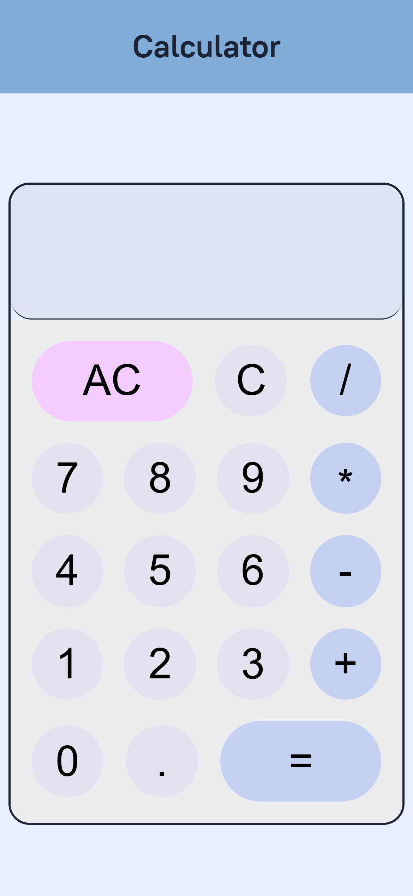

# Odin Calculator

This is a simple Calculator project I made while doing TheOdinProject Foundations Course.

It contains basic functionality - Addition, Subtraction, Multiplication and Division.
It also support float numbers.

It calculates results simply from left to right without any operator precedence.

It has proper parsing and validations to prevent invalid inputs.

It supports taking input both from the given buttons as well as from keyboard, so use the one you prefer :)

Calculator body is responsive and should look fine on most devices. It is tested on various mobiles, tablets and desktops resolutions using Chrome Dev Tools.

Colors have proper contrast according to their backgrounds as suggested by Chrome Dev Tools.

It has two parts in screen, top row which shows live result in small font, and main input row which shows input and result when pressed equal.

## Demo

https://shivamkumar2002.github.io/calculator-odin/
## Screenshots

## Features

- Addition, Subtraction, Multiplication, Division Support
- Simple and Intuitive UI
- Subtle Animation on Button Press
- Input by Button as well as Keyboard
- Floating Numbers Support
- Proper Input Handling
- Show Live Result
- Responsive Layout
- Proper Color Contrast

## 🛠 Skills Used

HTML, CSS, JavaScript, DOM Manipulation, JavaScript Events

## Authors

- [@ShivamKumar2002](https://www.github.com/ShivamKumar2002)
- [@RaghavKumar09](https://www.github.com/RaghavKumar09)

## License

[MIT](https://choosealicense.com/licenses/mit/)

## Contributing

Contributions are always welcome! Open a pull request or issue :)

